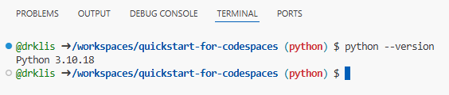
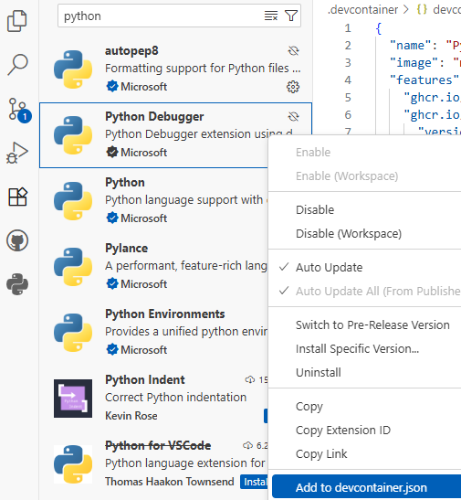

# Python for Codespaces
This tutorial combines a modification of [skills-dev/code-with-codespaces](https://github.com/skills-dev/code-with-codespaces) with an expense tracker developed by [drklis](https://github.com/drklis) using Claude AI. This project uses Python, including the matplotlib and pandas libraries, along with JavaScript (Express.js), but you don't have to actually know these programming languages in order to work with this tutorial and learn more about codespaces. It also includes some practice interacting with the terminal shell.

*Prerequisites:* You should have already completed the Haikus for Codespaces tutorial and have access to your repository with both `main` and `python` branches.

### Instructions

#### Getting Set Up
1. Navigate to your existing repository from the Haikus tutorial (the one you created last week, if you attended Tech Tacos, or just now).
2. Switch to the `python` branch. In your repository on GitHub, click the branch dropdown (currently showing "main") and select "python."
3. Create a new codespace on the python branch. Click the green "<> Code" button and then click "Create codespace on python." Wait for the Codespace to load and get set up -- this will take a few minutes as it installs Python and data visualization libraries!  **You should now have 2 tabs open: A) these instructions and B) the codespace itself.**
4. Test your Python environment. In the terminal, enter the following code and press enter `python --version`. You should see Python 3.10.x come up (where the x will be a number) as in the image below.
   
5. In the left navigation sidebar, open the "Explorer" tab (the one at the top that looks like two pieces of paper 📄). Click on `.devcontainer` which is a folder, and then click on `devcontainer.json`. Notice how the first line calls `"name": "Python 3.10 + Node.js",` as programming languages to be loaded into the codespace. In Step 4, we verified that we're running Python 3.10!
6. A little further down, you can see the customizations that have been loaded into the environment:
   ```json
   "customizations": {
    "vscode": {
      "extensions": [
        "ms-python.python"
      ]
    }
   },
   ```
   This means VS Code should automatically install the "Python" extension when the codespace is launched. Let's verify that! In the left navigation, select the "Extensions" tab (the one that looks like four building blocks where three are stable and one is diagonal ◻) and search for "python." Find entries for "Python" and "Python Debugger." Notice that the Python entry should already be installed, while the Python Debugger entry might not be. Right click on Python Debugger and select "Add to devcontainer.json" option.
   
   
   
   Did anything change in the previous code snippet? (*Hint*: `"ms-python.debugpy"` should have been added!)

#### Working with Python
7. Open the "Explorer" tab once again and open .devcontainer/postCreate.sh. Notice that it includes `sudo apt-get install sl` which is fun little command for a steam locomotive ASCII drawing. Type "sl" in the terminal and watch the animation! (Make sure you're not typing "s1" with the number one!)
8. Type `cd python` in the terminal and press enter to navigate to the python folder. Then type `python expense_tracker.py` to run the interactive expense tracker. (You could also use the combined command `cd python && python expense_tracker.py`.)

$\Longrightarrow$ *For this next part, you might want to "Maximize panel size" for the terminal to see everything.*

9. Follow the prompts to add 4-5 sample expenses across different categories. Try realistic amounts like $12.50 for lunch, $3.00 for coffee, etc.
10. Choose option 2 in the expense tracker menu to check out the "View Summary" and consider whether you want to add more expenses and then see how things change. 
11. Choose option 3 in the expense tracker menu to generate the data visualizations. The program will generate pie charts and statistics, saving them as PNG files in the `public/charts` folder.
12. Exit the expense tracker (option 4), then start the web server with the following command: ``cd .. && npm start`` When a display message pops up asking if you want to display port, choose yet. This will open a tab in your browser with the haikus exercise; add "/expenses" to the end of that web adddress to see your charts displayed on a webpage!
13. Before we get too far ahead, now is a good time to commit our changes so far. You can either use VS Code's interface to stage the changes and commit them, or you can use terminal commands. After you do so, you can sync your changes to push the codespace additions to the python branch.

*Digging deeper (optional)*

15. Now, let's open the Python code. Open the "python" folder; then open "expense_tracker.py" and browse through it a little. Notice the expense categories, the interactive menu system, and the chart generation functions. You don't need to understand all the code, but get a sense of how it's structured.
16. Want to try changing something small? Find the `categories` dictionary around line 8. Change one of the existing categories to something more relevant to your life (e.g., change "Other" to "Textbooks" or "Coffee").
17. Run the expense tracker again -- see how your change works!
18. Notice that the program doesn't save expenses between sessions or track them by specific dates. This is intentional for simplicity -- building persistent data storage would require databases or file management, making this a much more complex project.

#### Finishing up
19. In the codespace, go to File menu > Close Remote Connection to properly close the codespace environment.
20. Back in the GitHub repo view, create a pull request to merge the python branch into main, then merge it to bring your Python capabilities into your main branch.
21. If you want to experiment further with this code, create a new branch from main (like "python-experiments") to avoid affecting your completed tutorial work.

## Additional Resources
- [Matplotlib Documentation](https://matplotlib.org/stable/tutorials/index.html)
- [Pandas Getting Started Guide](https://pandas.pydata.org/docs/getting_started/index.html)
- [Python Data Science Handbook](https://jakevdp.github.io/PythonDataScienceHandbook/)
